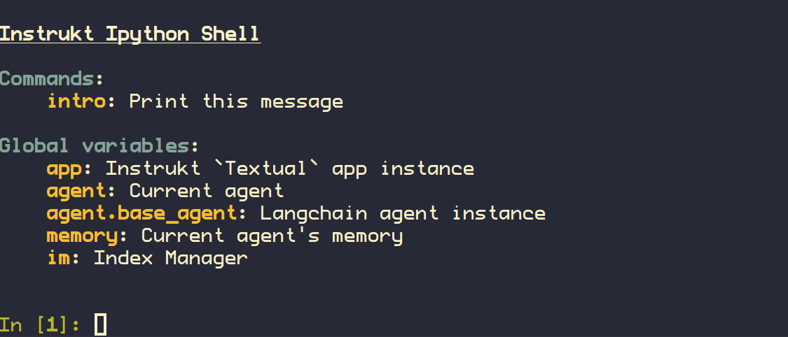

# >_⚡  Instrukt

 **Terminal AI Commander at your fingertips**

[coding assistant example](https://github.com/blob42/Instrukt/assets/210457/244fb490-4774-4877-abf6-f64e94f24922)

Checkout [demos](demos.md) for more examples.

**NOTE**: This is a work in progress, expect bugs and api changes.

## Introduction

Instrukt is a terminal-based AI integrated environment. It offers a platform where users can:

- :robot: Create and instruct modular AI agents
- :card_file_box: Generate document indexes for question-answering
- :toolbox: Create and attach tools to any agent

Agents are simple **drop-in Python packages** that can be extended, shared with others, attached to tools and augmented with document indexes.

Instruct them in natural language and, for safety, run them inside secure containers (currently implemented with Docker) to perform tasks in their dedicated, sandboxed space :shield:.

Built with: [Langchain](https://github.com/hwchase17/langchain), [Textual](https://github.com/Textualize/textual), [Chroma](https://github.com/chroma-core/chroma)

**Consulting Services**: Need help with Langchain or AI integration ? You can reach out to me at [contact@blob42.xyz](mailto://contact@blob42.xyz)

## TOC

- [Usage](#usage)
- [Features](#features)
- [Supported Platforms](#supported-platforms)
- [LLM Models](#llm-models)
- [Document Indexes and Question-Answering](#document-indexes-and-question-answering)
- [Roadmap](#roadmap)
- [Contributing](#contributing)
- [Patreon](#patreon)
- [Social](#social)
- [Vision](#vision)
- [License](#license)

## Usage

### Quickstart

- `pip install instrukt[all]`
- export `OPENAI_API_KEY` with your OpenAI API key.
- run `instrukt`
- If the color scheme is broken, export `TERM=xterm-256color`

- A configuration file will be created at:
  `~/.config/instrukt/instrukt.yml`

You can run instrukt on headless server such or a docker container with CUDA support.

**NOTE**: if you are starting with a bare container, you need at least g++ and libmagic.

Check the [quickstart](docs/source/quickstart.md) and [install](docs/source/install.md)
guide for more details.

#### From source:

- Make sure the latest version of `poetry` is installed.
- Set your virtualenv
- Clone the repository
- Run `poetry install -E all --with dev,test` 
- This will install Instrukt including extra tools for agents. 

[See the installation guide for more details](docs/source/install.md)

### Default Agents:

**Coding AI**: A coding assistant. Create indexes over any code base and attach it to the agent to do RAG (Retrieval Augmented Generation)

**Chat Q&A**: A simple conversational agent.

## Features 

#### :computer: Keyboard and Mouse Terminal Interface:

- A terminal-based interface for power keyboard users to instruct AI agents without ever
  leaving the keyboard.
- [Rich](https://github.com/Textualize/rich) colorful agent outputs with markdown and
  source code support thanks to the [Textual](https://github.com/Textualize/textual) TUI
  library.
- Run Instrukt on bare metal or docker containers with CUDA support.
- Remote access with SSH and terminal multiplexers.

#### :robot: Custom AI Agents:
- Design [custom agents](docs/source/quickstart.md#custom-agents) and tools. 
- Agents are simple python packages can be shared and loaded by other users.

#### :books: Chat with code and documents:
- Index your data and let agents retrieve it for question-answering. 
- Create and organize your indexes with an easy UI.
- Index creation will **auto detect programming languages** and optimize the splitting/chunking
  strategy accordingly.
- Fuzzy select (fzf, dmenu ...) source documents that were used for retrieval `ctrl+p`

#### :wrench: Tools:
- Use the pre-defined toolset or design your own tools.
- Attach or detach tools to agents on-the-go, tailoring your AI workflows to your needs.

#### :zap: Prompt Console :
- Integrated REPL-Prompt for quick interaction with agents, and a fast feedback loop for development and testing.
- Automate repetitive tasks with custom commands.
- Builtin prompt/chat history.
- Use `vim`, `emacs` or any external `$EDITOR` to edit messages.

#### :bird: LangChain:

- Leverage the LangChain ecosystem to automate anything.
- WIP: Extensible API for integrating with other frameworks.

#### :shield: Secure Containers:

- Run agents inside secure docker containers for safety and privacy.
- Use [gVisor](https://gvisor.dev/) runtime for a full isolation of the agent.

**note**: The docker agent is only available to [Patreon](#patreon) supporters as an early preview.

#### :microscope: Developer Console:
Debug and introspect agents using an in-built IPython console. `ctrl+d`

## Document Indexes and Question-Answering

- Indexes can be  created using OpenAI or local embeddings models.
- [Chroma](https://github.com/chroma-core/chroma) for managing indexes.
- Create and manage indexes using the **Index Management** UI (press `I`)
- Indexing a directory will auto detect programming languages and use an appropriate
  splitting strategy optimized for the target language.
- Indexes can be attached to any agent as a **retrieval** tool using the `index` menu
  in the top of the agent's window.
- Agents can use attached indexes for question-answering.

## Supported platforms:

- Linux/Mac.
- Windows tested under WSL2.

### LLM Models

- Currently only **OpenAI** supported.
- Using private local models is the **next milestone**.

## Roadmap

- [ ] private local LLM models
    - [x] Local embeddings
        - [x] HF SetenceTransformers supported embeddings.
        - [x] [Instructor Embeddings](https://instructor-embedding.github.io/)
    - [ ] use text-generation-webui API
    - [ ] emulate [PrivateGPT](https://github.com/imartinez/privateGPT)
    - [ ] use self hosted [go-skynet/LocalAI](https://github.com/go-skynet/LocalAI)
- Indexing and embeddings
    - [x] Index directories and auto detect content. ( see `AutoDirLoader`)
    - [x] Detect programming languages and use the appropriate splitter.
    - [ ] Load a git repository from URL
    - [ ] Load any webpage / website.

- [ ] Documentation
    - [ ] Creating agents
    - [ ] Creating tools
    - [ ] Indexing and chat with documents and source code.
    - [ ] Example use cases  
    - [ ] Tutorials.

## Contributing

Any contribution, feedback and PR is welcome !

You can help with:

- Testing and creating Issues for bugs or features that would be useful.
- If you have technical skills, you are welcome to create a PR.
- If you don't have technical skills you can help with documentation, adding examples
  and tutorials or create new user stories.

## Patreon

By becoming a patron, you will help me continue committing time to the development of Instrukt and bring to life all the planned features. Check out the [Patreon page](https://www.patreon.com/Instrukt) for more details on the rewards for early supporters.

## Social

Join the [Discord](https://discord.gg/wxRwRcJ7) server to keep updated on the progress or ask for help.

## Vision

AI should be accessible to everyone and not a walled garden for big corporations and SaaS services. 

Instrukt is a modest contribution to create tools that empower users without compromising their freedoms. The short-term goal is to make it usable with minimal reliance on external APIs and services, giving users the choice to opt for local models and self-hosted services.

# License

Copyright (c) 2023 Chakib Ben Ziane. All Rights Reserved.

Instrukt is licensed with a AGPL license, in short this means that it can be used by anyone for any purpose. However, if you decide to make a publicly available instance your users are entitled to a copy of the source code including all modifications that you have made (which needs to be available trough an interface such as a button on your website), you may also not distribute this project in a form that does not contain the source code (Such as compiling / encrypting the code and distributing this version without also distributing the source code that includes the changes that you made. You are allowed to distribute this in a closed form if you also provide a separate archive with the source code.).
